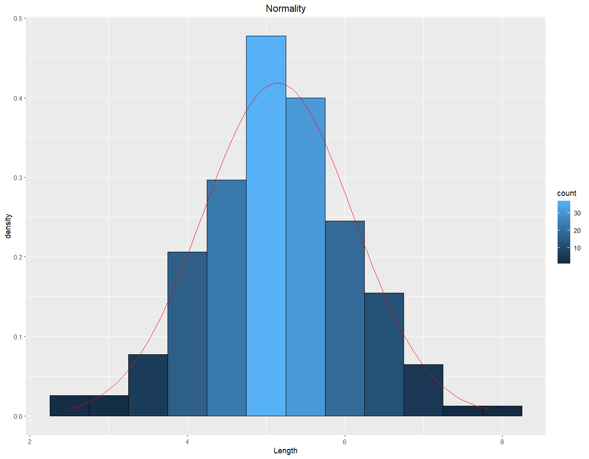
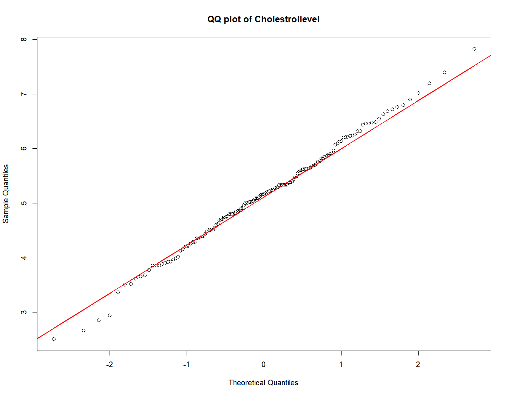

# 📊 Hypothesis Testing on Cholesterol Levels  

*Statistical hypothesis testing to analyze the effect of a diet program on cholesterol levels using R*  

---

## 📌 Overview  

This project performs **hypothesis testing** to determine whether an individual's **cholesterol level** has changed after following a **6-month diet program**. Using **R**, the dataset (`CholestrolLevel.xlsx`) is analyzed to assess normality, compute statistical measures, and conduct a **two-tailed z-test** to evaluate changes in cholesterol levels.  

---

## 🛠 Key Features & Analysis  

✅ **Hypothesis Statements**  
   - **Null Hypothesis (H0):** The mean cholesterol level remains **5.95** after the diet.  
   - **Alternative Hypothesis (H1):** The mean cholesterol level **differs** from **5.95** after the diet.  

✅ **Normality Assessment**  
   - **QQ Plot**: Determines if data follows a normal distribution.  
   - **Histogram with Normal Curve**: Visualizes the data distribution.  

✅ **Step-by-Step Hypothesis Testing**  
   - Define hypothesis statements.  
   - Check normality assumptions.  
   - Calculate **z-score** and **p-value** to determine significance.  

✅ **Data Analysis in R**  
   - **z-score calculation**:  
     ```r
     z = (mu - mu0) / (sigma / sqrt(n))
     ```  
   - **p-value calculation**:  
     ```r
     p <- 2*pnorm(abs(z), lower.tail=FALSE)
     ```  

✅ **Summary of Findings & Conclusion**  
   - If **p-value < 0.05**, reject the null hypothesis (H0) and conclude a significant change in cholesterol levels.  

---

## 📊 Data Analysis Summary  

### 1️⃣ Normality Assessment: QQ Plot & Histogram  

- The **QQ plot** shows that the data points are aligned with the reference line, indicating normality.  
- The **histogram** exhibits a **bell-shaped curve**, further supporting normality.  

📌 **Visualizations:**  
✅ **Histogram with Normal Curve**  
  

✅ **QQ Plot of Cholesterol Levels**  


### 2️⃣ Hypothesis Testing: Two-Tailed Z-Test  

- **Given Values:**  
  - Population Mean (µ0) = **5.95**  
  - Population Standard Deviation (σ) = **0.897**  
  - Significance Level (α) = **0.05**  

- **Results from R Analysis:**  
  - **Computed z-score:** **-11.13**  
  - **Computed p-value:** **8.82 × 10⁻²⁹**  

- **Conclusion:**  
  - Since **p-value < 0.05**, the null hypothesis (H0) is **rejected**.  
  - This provides **strong evidence** that the mean cholesterol level **after the diet is significantly different from 5.95**.  

---

## 📜 Key Learnings & Insights  

🔹 **Statistical Testing:** Practical application of hypothesis testing in healthcare research.  
🔹 **Data Distribution:** QQ plots and histograms confirm normality before testing.  
🔹 **Evidence-Based Decision Making:** Statistical significance leads to actionable conclusions.  

This project is crucial for **healthcare studies, clinical trials, and diet effectiveness research**.  

---

## 🔧 Technologies Used  

- **Programming Language:** R  
- **Libraries:** ggplot2, stats, openintro  
- **Statistical Methods:** z-test, p-value computation, normality testing  
- **Visualization Techniques:** QQ Plot, Histogram  

